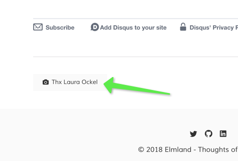

# Jekyll unsplash credit include

If you use photos from [unsplash.com - Photos from everyone](https://unsplash.com/) in your jekyll site, you should include a credit link.

> Even though credit isn't required, Unsplash photographers appreciate a credit as it provides exposure to their work and encourages them to continue sharing. A credit can be as simple as adding their name with a link to their profile or photo.

# Getting started
1. Copy the small **usplash_credits.html** file in your ```jekyll/_inlcude`` folder. 
2. Inlude `````` in your ``` jekyll/_layouts/post.html ```
3. In your posts include the 2 variables:
	* imagecredit_id: '@usplash_id'
	* imagecredit_name: 'usplash user name'

# Example

You want to inlcude the following image (Laura Onkel [https://unsplash.com/@viazavier](https://unsplash.com/@viazavier) in your blog.
 


### jekyll/_layouts/post.html
```xml 
<div>
	<div>
		<div>
		...
        <hr />

        

      </article>
    </div>
  </div>
</div>
```

### jekyll/_posts/2017-03-04-example-post.html

imagecredit_id: '@viazavier'

imagecredit_name: 'Laura Ockel'

```xml 
---
layout: post
title: Example post
description: This is an example post.
featured: false
author: elmolm
image: '/images/posts/flower_laura_ockel_viazavier.jpg'
imagecredit_id: '@viazavier'
imagecredit_name: 'Laura Ockel'
opengraph_type: article
---

Lorem ipsum dolor sit amet, consetetur sadipscing elitr, sed diam nonumy eirmod 
tempor invidunt ut labore et dolore magna aliquyam erat, sed diam voluptua. 
At vero eos et accusam et.
```

### Resulting credit link


